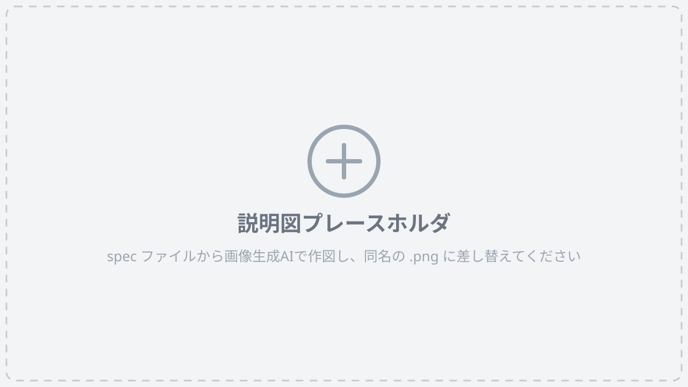

<!-- _class: title -->
<!-- _paginate: false -->

# 社内ナレッジ共有ツール導入の提案

## 現状の課題 ／ 仕組み ／ 導入の進め方 ／ 期待される効果

---

<!-- _class: toc -->

# 目次

本資料は、社内のナレッジ共有を改善するためのツール導入提案です。次の順にまとめます。

1. 背景と現状の課題
2. 提案するツールと仕組み
3. 導入の進め方
4. 期待される効果

---

<!-- _class: section -->
<!-- _paginate: false -->

## Chapter 1

# 背景と現状の課題

---

# 知識の「サイロ化」

<!-- fig:fig-01 -->

- 業務上の知見・ノウハウが、個人や特定チームの内側に閉じている
- 解決済みの問題に、別の部署が一から取り組む**重複**が頻発している
- 知識が壁の内側に溜まり、外に出ていかない状態 =「**知識のサイロ化**」
- 進行すると、車輪の再発明が増える
- 異動・退職のたびに、その人の持つ知見がまるごと失われる

---

# 具体的な課題は3点

1. **情報の散在** — メール・チャット・各種ファイルサーバに散らばり、どこに何があるか分からない
2. **検索できない経緯** — 過去の議事録や設計判断の経緯が検索できず、同じ議論を繰り返している
3. **立ち上げの遅さ** — 新しく入った人が業務を立ち上げるまでに時間がかかり、教える側の負担も大きい

---

# これは「構造的な問題」

- これらの課題は、個人の努力不足が原因ではない
- 知識を**「貯める場所」**と**「探す手段」**が用意されていないことによる、**構造的な問題**である

---

<!-- _class: section -->
<!-- _paginate: false -->

## Chapter 2

# 提案するツールと仕組み

---

# 提案：社内Wiki型のナレッジ共有ツール

- 提案するのは、**社内Wiki型**のナレッジ共有ツール
- 全社員が記事を**書き・検索し・相互にリンク**できる
- 知識を集約する**単一の場所**を用意する

---

# ツールの仕組み

- ブラウザからツールにアクセスし、記事を作成・編集する
- 記事は**全文検索インデックス**に登録され、キーワードで横断的に検索できる
- 記事どうしは**リンク**でつながり、関連する知識をたどれる
- **権限管理**で、公開範囲を「全社／部署／限定」の3段階に制御できる

---

# 技術構成：4つの要素

- **Webアプリ／データベース／全文検索エンジン／認証基盤** の4要素で構成される
- 利用者の操作はWebアプリが受け取り、データベースと検索エンジンに振り分ける
- 認証基盤は既存の社内アカウントと連携させ、新たなID管理を増やさない

---

<!-- _class: section -->
<!-- _paginate: false -->

## Chapter 3

# 導入の進め方

---

# 段階的に導入する

- いきなり全社展開すると、使われないまま**形骸化するリスク**が高いため、段階を踏んで導入する
- **① パイロット運用** — 部署を1つ選び、1か月間の試験運用（既存ドキュメントを移行し、日常業務の中で実際に使ってもらう）
- **② ルール整備** — 試験運用のフィードバックをもとに、テンプレートや運用ルールを整える
- **③ 順次展開** — 部署を順次追加し、最終的に全社展開する
- **④ 継続改善** — 全社展開後も、記事の棚卸しと改善を定期的に続ける

---

# 導入フロー

---

# 判断のポイント

- 各段階の終わりに「**次に進むか、留まって改善するか**」を必ずレビューする
- 利用率が想定を下回る場合は、展開を急がず**原因の分析に戻る**

---

<!-- _class: section -->
<!-- _paginate: false -->

## Chapter 4

# 期待される効果

---

# 短期的に表れる効果

- **検索時間の短縮** — メールやチャットを遡って探していた情報が、キーワード検索で見つかる
- **議論の蒸し返しが減る** — 設計判断の経緯が記録される
- **立ち上がりが早くなる** — 新しく入った人が自分のペースでナレッジを読んで業務を立ち上げられ、教える側の負担も軽くなる

---

# 長期的な効果とねらい

- 知識が**個人ではなく組織に蓄積**されるようになる
- 異動や退職による**知見の消失を防げる**
- これが**サイロ化の解消**であり、本提案の最終的なねらいである
